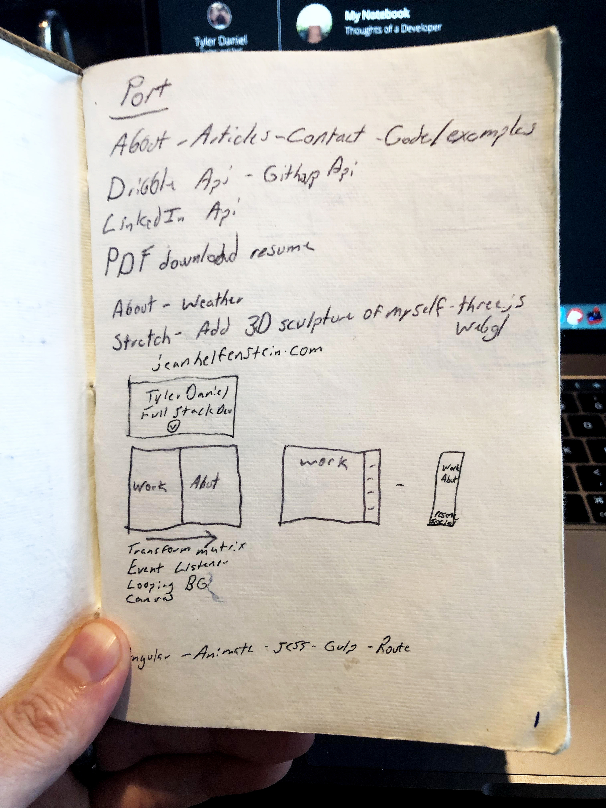

# Page 1

## Port

Page one is titled `Port`.  To the best of my knowledge this was pre software school.  My `Port` has the following pages. 
1. About (makes sense/ fitting)
2. Articles (I guess I was going to write / create a blog day one)
3. Contact (makes sense)
4. Code / Examples (ambitious considering all I made was a twitch plugin)

I was very ambitious with my api usage ideas, spoiler I did not use any of them and frankly, I am not sure some even exist.

**Stretch**

Apparently I wanted to make a 3d sculpture of my face and fully animate it for my first website.  DO NOT DO THIS.  I understand having high expectations for yourself, but somethings are unnecessary and way over the top.

Shoutout Jean Helfenstein for a dope ass website [jeanhelfenstein.com](http://jeanhelfenstein.com/)

**Buzz Words**

As a new developer you tend to hang on to buzz words you hear.  I have no clue what `Transform Matrix` means but I like it.  Again, I was over complicating things for a "first" website. 

**In Summary**

Take aways from the first page would be `KISS` "Keep-It-Simple-Stupid".  A website (nevermind a first website), should be simple, straight to the point and link to your [github](https://github.com/iamtylerd).

Cover Photo - Photo by Me