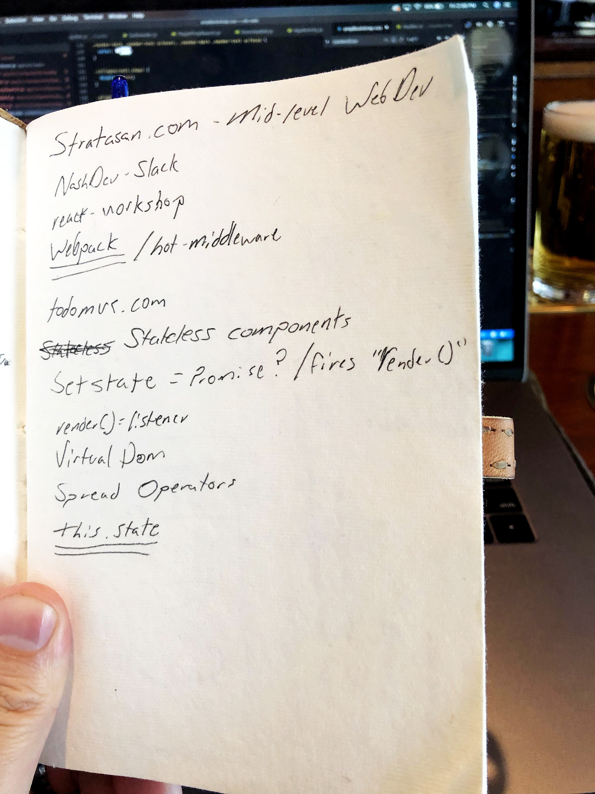

# Page 2
[For context of Notebook posts click here](/notebook)

## React
Let's ignore the job opportunity that I listed and just into my notes.  I can't remember where or why I took these notes, but they seemed important at the time.  

1. NashDev - Slack

I will say that Slack is very important, a great tool for learning, and finding a job.  I write down a lot of bullshit, but this is relevant.  Join your cities Slack channel and be active, it helps. 

2. Webpack

Honestly this deserves about 5 more underlines because I still don't understand `Webpack` completely and not sure I ever will.  Thankfully a lot of tools take out the confusion of Webpack (create-react-app, gatsby, etc), but if you are interested in front end development a good understanding of this is a must. 

3. TodoMVC.com

[TodoMVC.com](http://todomvc.com/) is a really cool site to get an understanding of how different libraries / frameworks utilize state to build a simple Todo list.  It's worth checking out.

4. React Shit

I am going to lump the rest together as `React Shit` (proper term), not all is only react for disclaimer.  

4a.  The first high level idea in React is stateless / statefull components. Think of it this way, you can create a react app using all statefull components, but it's not optimized assuming not every component has state.  It is better to separate and use stateless / dump components when its a view only layer.
`const Hello = () => <h1>Hello</h1>`

4b.  Virtual DOM.  This is a core component with React.  React has a `virtual DOM` which is defined as "The virtual DOM (VDOM) is a programming concept where an ideal, or “virtual”, representation of a UI is kept in memory and synced with the “real” DOM by a library such as ReactDOM."  The virtual dom is how React knows what to update on the `DOM`.  

4c.  Spread Operator. Basically means "Array, give me all your shit".  That's how I learned spread operator.

```
const numbers = [1,2,3]

console.log(numbers) // [1,2,3]

console.log(...numbers) // 1 2 3
```

4d.  `this.state` If you use react, you will use this.  In short, `this.state` is how you would "access" state for React (at a very high level).

## In Summary
Everyone starts somewhere.  I wrote down these things because I didn't understand them at the time.  It's ok to be confused and it's ok to Google.  I still do everyday.


Cover Photo - Photo by Me