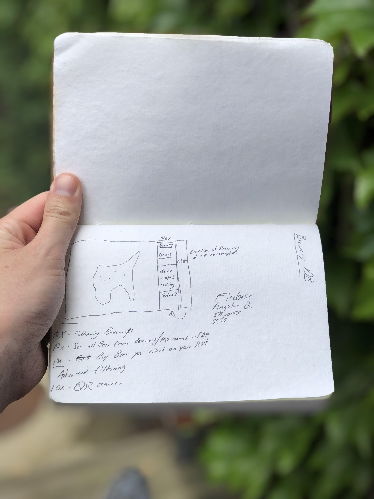

# Page 3
[For context of Notebook posts click here](/notebook)

## The First Big Idea
Along this journey of my notebook you will see I have many big ideas and unfinished projects, if a repo exists I will link it.
### The 10x mindset
I think this idea came from a Google talk, hence the 10x.  I like the idea of 10x and I should use it more.  It is a simple concept, think of an idea and then 10x it.  Usually something good will come out around the middle.  
*An example*
Lets build an app to monitor your BBQ temp while cooking (currently BBQ'ing as we speak).
> Idea : Have the app track temperature 

> 10X Idea: Have the grill detect what you are cooking and turn off when the ideal temp is achieved.

> Somewhere in the middle: I input the type of meat and the app will notify me when the food is done.

So the concept is simple and in a group setting it can be difficult but for this to work no one should use the word `no`.

Unfortunately I never got a chance to build the app, I just use [Untappd](https://untappd.com/) and if you want to follow me my profile is [here!](https://untappd.com/user/iamtylerd).

Cover Photo - Photo by Me